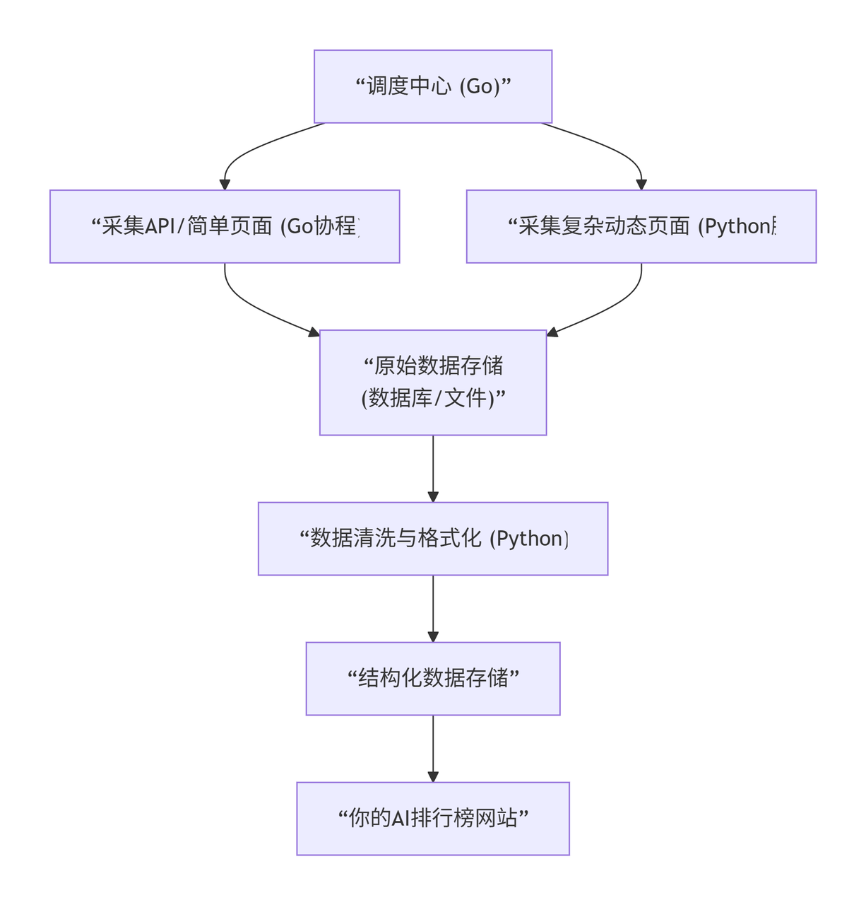

## 项目简要/为什么创建
最近AI层出不穷，媒体只是风声确立，总是特意炒大
这边汇总一下比较潮流的AI情况，结合热点、价格、模型能力给出一个排行榜进行参考
再给出一个综合打分，比如参考排名来自：40%能力+30%价格 + 30%热点之类的进行一个综合评分
同时汇总有意思的AI项目，同时为自己的AI每周博客栏目做好数据准备和来源准备

参考实现： https://llm-stats.com/ 
核心： “实用价值榜”的榜单逻辑和评分公式 
详细介绍
本站点提供最新的大模型相关动态和个人测评，抓取主流热点新闻和模型新闻动态，提供主流模型站点入口以及本人真实使用评测

实现进度
[x] MVP 排行榜数据获取和接入手动
未来：

  [] py脚本自动每天更新

  
  [] 有盈利机会后，启动机器自行测评或者抓取更多的数据
  
[] LLM新闻（周刊）

  [] LLM AI周报 （工作流汇总 视频，主站：bilibili+youtobe）
  
[] 模型广场

  [] 提供主流的综合的模型服务商入口（未来商业广告）
  
[] HOT
  [] 抓取主流平台/小红书/Bilibili/抖音/Github/X等平台热点情况
  
[] 测评
  [] 真实使用评价

## 具体实现
### 简单架构

